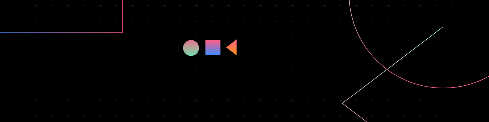

                                                                                      # Hi, I'm Zeel 👋

### 👨‍💻  Machine Learning Enthusiast 

I am a final-year Mechanical Engineering student passionate about exploring the intersections of machine learning and robotics. Currently, I'm focused on using my engineering skills to solve complex problems, working on exciting projects in both the mechanical and data science fields.

---

### 🚀 About Me

- 🎓 **Mechanical Engineering** undergraduate student with hands-on experience in CAD and Machine Learning.
- 🔭 Currently working on projects like:
  - **Application of Image Processing and Machine Learning**: Predictive model to anticipate slug formation.
- 📫 Reach me at: [zeel0725@gmail.com](mailto:zeel0725@gmail.com)
- 🖇️ Connect with me: [LinkedIn](http://www.linkedin.com/in/Zeel2212) | [GitHub](https://github.com/Zeel0725)

---

### 🔧 Technologies & Tools

- **Programming Languages**: Python, C++, JavaScript
- **Machine Learning**: Logistic Regression, Decision Trees, Random Forest
- **CAD & Simulation**: AutoCAD, Fusion 360
- **Visualization Tools**: Tableau, Gnuplot

---

### 🌟 Featured Projects

- **1D Fin Temperature Distribution**  
  Developed C++ code to simulate temperature distribution in a 1D fin subjected to volumetric heating. Used the TDMA algorithm and Gnuplot for visualization.  
  [Check the project](https://github.com/Zeel0725/1D-Fin-Temperature-Distribution)

- **Employee Attrition Prediction Model**  
  Developed a predictive model using **Logistic Regression**, **Decision Tree**, and **Random Forest** algorithms to predict employee attrition.  
  - Performed feature engineering and created new variables based on the available data.
  - Used hyperparameter tuning to improve model performance.
  - Conducted statistical tests to analyze correlations and feature relevance.
  - Compared different models to select the best-performing one.

- **Taxi Fare Prediction Model**  
  Created a machine learning model to predict taxi fares based on various factors, using Python.  
 

---

---

Feel free to explore my repositories and connect with me!

