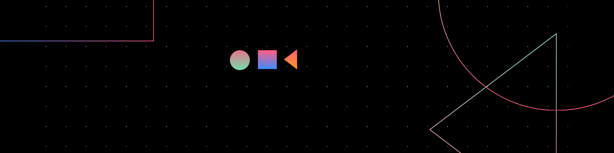

<h1 align="center">Hi, I'm Zeel! 👋</h1>
<h1 align="center">https://zeel0725.github.io</h1>

<!--
  
-->

### 🚀 About Me

<!--- 🎓 **Mechanical Engineering** undergraduate student.
- 🔭 Currently working on projects like:
  - **Application of Image Processing and Machine Learning**: Model to predict slug formation. --->
- 📫 Reach me at: [zeel0725@gmail.com](mailto:zeel0725@gmail.com)
<!--- 🖇️ Connect with me: [LinkedIn](http://www.linkedin.com/in/Zeel2212) | [GitHub](https://github.com/Zeel0725) --->

<h3 align="left">🖇️ Connect with me:</h3>

---

### 🔧 Technologies & Tools

- **Programming Languages**: Python, JavaScript, HTML, CSS
- **Web Frameworks**: React, Node.js, Django
- **ML Libraries**: Pandas, NumPy, scikit-learn, Matplotlib, Seaborn
- **ML/Deep Learning Frameworks**: TensorFlow, PyTorch, Keras
- **Tools & Platforms**: Git, Tableau, Microsoft Office
- **IDEs**: Visual Studio Code, IntelliJ IDEA
- **CAD Software**: SolidWorks, AutoCAD, Autodesk Fusion 360

---

<!--

 --->

  

  

<!-- -->

---

### 🌟 Featured Projects

<!---- - **Employee Attrition Prediction Model**
  Developed a predictive model using **Logistic Regression**, **Decision Tree**, and **Random Forest** algorithms to predict employee attrition.  
  - Performed feature engineering and created new variables based on the available data.
  - Used hyperparameter tuning to improve model performance.
  - Conducted statistical tests to analyze correlations and feature relevance.
  - Compared different models to select the best-performing one.
  
  [Check the project](https://github.com/Zeel0725/EmployeeAttritionPrediction) --->

- **1D Fin Temperature Distribution**  
  Undergrad project. Developed a program using C++ code to simulate temperature distribution in a 1D fin subjected to volumetric heating. Used the TDMA algorithm and Gnuplot for             visualization.

  [Check the project](https://github.com/Zeel0725/1D-Fin-Temperature-Distribution)

<!---- **Taxi Fare Prediction Model**  
  Created a machine learning model to predict taxi fares based on various factors, using Python. --->
 

---

<!--
 ---->

<!---Feel free to explore my repositories and connect with me! --->

